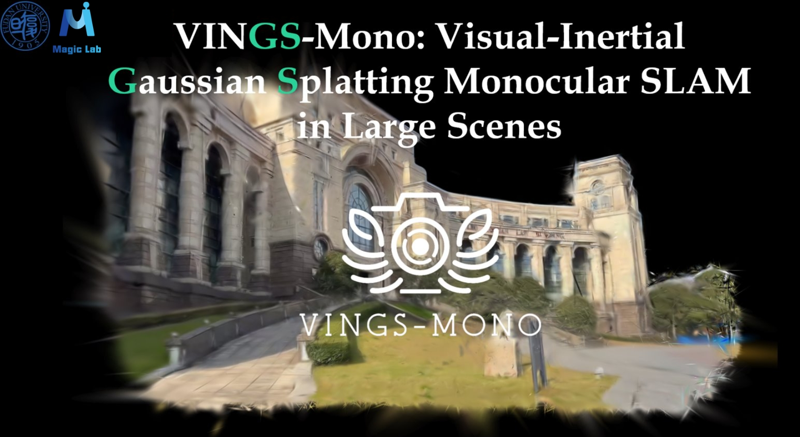

<p align="center">
  
  <h1 align="center"><strong>VINGS-Mono: Visual-Inertial Gaussian Splatting Monocular SLAM in Large Scenes</strong></h1>

</p>


<div align="center">
<a href='https://arxiv.org/abs/2501.08286'></a> &nbsp;&nbsp;&nbsp;&nbsp;&nbsp;
 <a href='https://vings-mono.github.io/'></a> &nbsp;&nbsp;&nbsp;&nbsp;&nbsp;
 <a href='https://github.com/Fudan-MAGIC-Lab/VINGS-Mono'></a> &nbsp;&nbsp;&nbsp;&nbsp;&nbsp;
<a href='https://www.youtube.com/watch?v=vniTZcNj_tA&t=163s'></a> &nbsp;&nbsp;&nbsp;&nbsp;&nbsp;
  <a href='http://www.fudanmagiclab.com'></a> &nbsp;&nbsp;&nbsp;&nbsp;&nbsp;
</div>


# Step 1. Setup Enviroment.

- Our python version is 3.9.19, cuda version is 11.8 and we put our specific enviroment setup in `environment.yaml`. 
    - Setup enviroment may take a little long time (about an hour), please be patient.
    ```python
    git clone --recursive https://github.com/Fudan-MAGIC-Lab/VINGS-Mono
    cd VINGS-Mono
    bash set_env.sh
    ```
- Download pretrained checkpoints.
```
    mkdir ckpts & cd ckpts
    wget https://huggingface.co/Promethe-us/VINGS-Mono-Checkpoints/resolve/main/droid.pth
    wget https://huggingface.co/Promethe-us/VINGS-Mono-Checkpoints/blob/main/metric_depth_vit_small_800k.pth
    mkdir lightglue & cd lightglue
    wget https://huggingface.co/Promethe-us/VINGS-Mono-Checkpoints/resolve/main/superpoint.onnx
    wget https://huggingface.co/Promethe-us/VINGS-Mono-Checkpoints/resolve/main/superpoint_lightglue.onnx
    (optional) wget https://huggingface.co/Promethe-us/VINGS-Mono-Checkpoints/blob/main/FastSAM-x.pt
```


# Step 2. Prepare Dataset.

- Demo1: [Hierarchical 3DGS Dataset](https://repo-sam.inria.fr/fungraph/hierarchical-3d-gaussians/)
    - Please agree with the license first.
    - We download `Calibrations` and select top view camera images, we upload our processed data on [huggingface](https://huggingface.co/datasets/Promethe-us/VINGS-Mono-Dataset).

- Demo2: Hotel Dataset
  - This dataset is collected by [RTG-SLAM](https://github.com/MisEty/RTG-SLAM), please agree with the license first.
  - We upload it on [huggingface](https://huggingface.co/datasets/Promethe-us/VINGS-Mono-Dataset). 

- In terms of Waymo, KITTI and KITTI360, follow this [file](docs/PREPARE_DATA.md).


# Step 3. Run.

- Don't forget to change `*.yaml`'s attributes in `configs/`:
  - `dataset:root`
  - `output:save_dir`
  - `frontend:weight`


- Visualizing BEV map in large scale scenes and save checkpoint is time-consuming, you can close them in config file by setting `use_vis` to False.

  ```cmd
  # Demo1: SmallCity.
  python scripts/run.py configs/hierarchical/smallcity.yaml
  ```


  ```cmd
  # Demo2: Hotel.
  python scripts/run.py configs/rtg/hotel.yaml
  ```

  ```cmd
  # KITTI.
  python scripts/run.py configs/kitti/sync/kitti_2011_09_30_drive_0028.yaml
  # KITTI360.
  python scripts/run.py configs/kitti360/unsync/kitti360_2013_05_28_drive_0002.yaml
  ```


# Moblie App.
- Our Mobile App Repo: https://github.com/victkk/3DGS_SLAM_mobile_app.git.
- We need a server with GPU to train Gaussian Splatting, and we have develop an mobile app for VINGS-Mono. You can download it from here. You should connect your phone with the server and run the app, we provide an apk that you can directly install on your android phone.


# Acknowledgement.

- This work is built on many amazing research works and open-source projects, thanks a lot to all the authors for sharing!

    - [2DGS](https://github.com/hbb1/2d-gaussian-splatting)
    - [Taming3DGS](https://github.com/humansensinglab/taming-3dgs)
    - [DBAFusion](https://github.com/GREAT-WHU/DBA-Fusion)
    - [FastSAM](https://github.com/CASIA-IVA-Lab/FastSAM)
    - [VINS-Mono](https://github.com/HKUST-Aerial-Robotics/VINS-Mono)
    - [OpenVINS](https://github.com/rpng/open_vins)
    - [RTG-SLAM](https://github.com/MisEty/RTG-SLAM)


# Bibtex.
- We will be very gratitude if our work really helps you. 
  ```python
  @article{wu2025vings,
    title={Vings-mono: Visual-inertial gaussian splatting monocular slam in large scenes},
    author={Wu, Ke and Zhang, Zicheng and Tie, Muer and Ai, Ziqing and Gan, Zhongxue and Ding, Wenchao},
    journal={arXiv preprint arXiv:2501.08286},
    year={2025}
  }
  ```


# Contact us.
- If you have any implementation bugs or error, don't hesitate to contact us. 
  - Ke Wu: kewu23@m.fudan.edu.cn
  - Zicheng Zhang: zhangzc.fdfz@gmail.com
